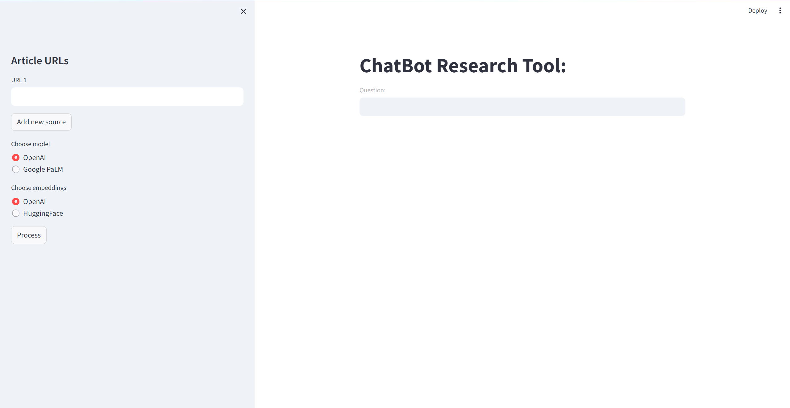

# ChatBot Research Tool 

User-friendly research tool designed for  information retrieval. Users can input article URLs and ask questions to receive relevant insights



## Features

- Load URLs to get article content.
- Process content using LangChain's UnstructuredURL Loader
- Toggle embedding options, construct vector database and leverage FAISS for the retrieval of relevant information
- Interact with the LLM of your choice (ChatGPT/Google PaLM) input queries and receive answers along with source URLs.


## Instructions

1. Install the required dependencies using pip:

```bash
  pip install -r requirements.txt
```
2. Add your OpenAI and Google PaLM API keys to the .env file 

```bash
  OPENAI_API_KEY = 'your_openai_api_key_here'
  GOOGLE_API_KEY = 'your_google_api_key_here'
```
3. Run the Streamlit app:
```bash
streamlit run main.py

```
the Streanlit app can now be viewed in your browser.

4. Add URLs on the sidebar
5. Choose your desired embeddings and LLM model 
6. Split text, create embeddings and vector database using your preferred embeddings by clicking the "Process" button
7. Input queris regarding the supplied URLs and receive answers.

## Project Structure

- main.py: The main Streamlit application script.
- helper_funcs.py: additional functions required for chain generation
- requirements.txt: A list of python packages needed for the project.
- faiss_db.pkl: A pickle file storing the FAISS vector db.
- .env: Configuration file for storing your OpenAI/Google PaLM API key.